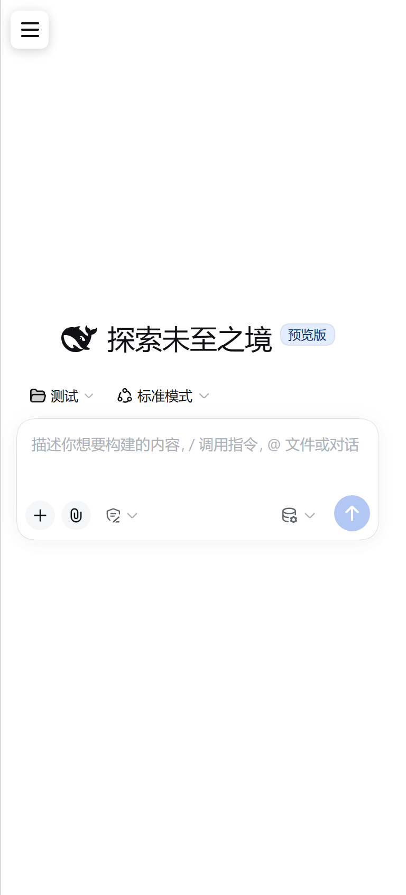
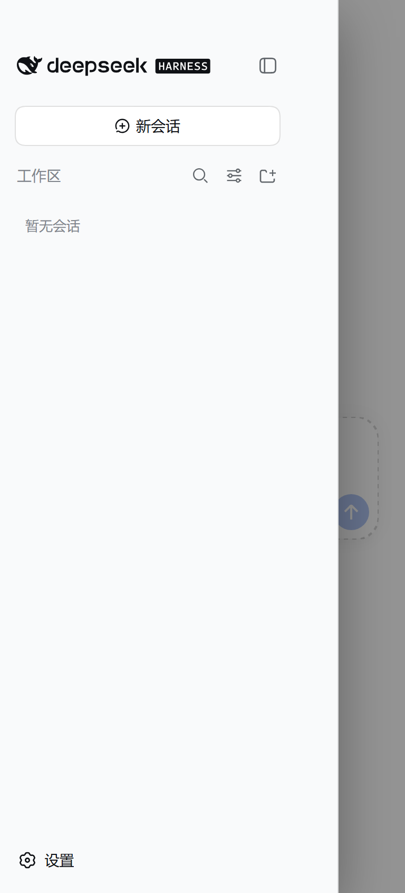
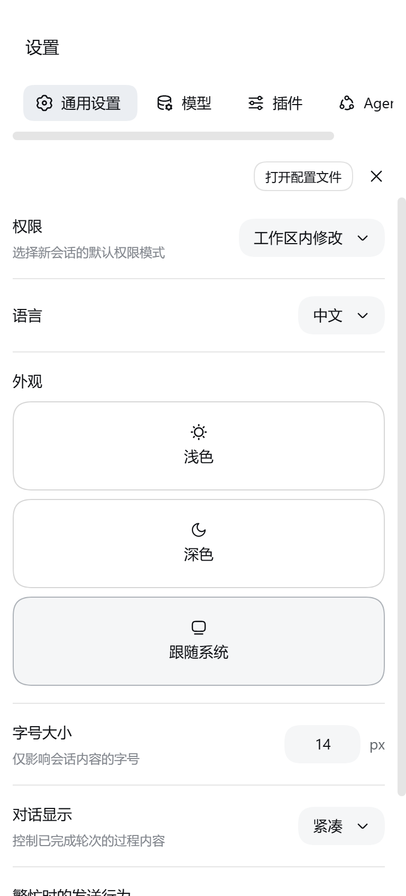
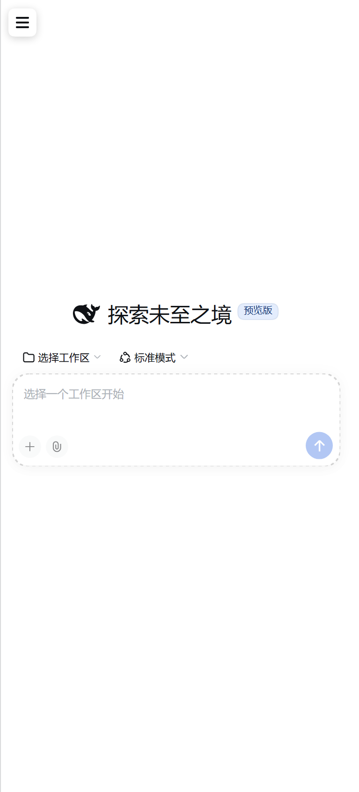

# DSH Mobile

> 把 **DeepSeek Harness (dsh)** 装进 Android 手机的 App。
>
> 内置 proot + Ubuntu 24.04 + Node 24 + dsh，全部本地运行，不依赖远程服务器。

**当前版本：v0.33.0（首个公开测试版）**

---

## 这是什么

[dsh](https://github.com/deepseek-ai/deepseek-harness) 是 DeepSeek 出的开源 agent harness，
但它是个 **Node.js 应用**，官方只提供桌面端和命令行。想在手机上用，就得把一整套 Linux 用户态搬进去。

DSH Mobile 做的就是这件事：APK 里内置一个完整的 Ubuntu 用户态（proot），
在里面跑 Node 和 dsh，再用 WebView 承载它的 Web UI —— 并且针对手机屏做了真正的移动端适配。

---

## 特性

### 内核层（已稳定）

- **全部本地运行**：proot + Ubuntu 24.04 + Node 24 + dsh，数据不离开手机
- **首次启动自动解包**，之后秒进（rootfs 约 30MB + seed 约 95MB，已随包分发）
- **不需要 root**，不需要 Termux，装完即用
- 自动从系统取 DNS、自动清理残留进程（防端口占用）

### 移动端适配（自研客户端插件）

dsh 的 Web UI 是 desktop-first 的三栏布局，384px 的手机屏根本放不下。
本项目写了一个 **dsh 官方格式的客户端插件**来做适配，而不是从外面注入 CSS：

| 能力 | 说明 |
| --- | --- |
| 单栏布局 | 三栏 Grid 收敛为单栏，中栏吃满整宽 |
| 浮层抽屉 | 侧栏变成左侧抽屉，300ms 缓动，遮罩点击关闭 |
| 边缘手势 | 左缘右滑打开抽屉；抽屉内左滑关闭（带纵向位移过滤） |
| 全屏设置 | dsh 设置面板改为整屏，导航变顶部横向标签条 |
| 安全区适配 | 汉堡按钮避开刘海与状态栏 |
| 主题切换过渡 | 亮/暗切换走 240ms 颜色过渡，不硬切 |

插件里的选择器全部基于 **dsh 构建产物的语义类名**（如 `[class$="_sidebarCol"]`），
不硬编码 CSS Modules 的哈希值 —— 所以 dsh 小版本升级换了哈希，插件不会跟着失效。

### 原生设置页

除 dsh 自带设置外，App 自己有一套原生设置（右下角 ⚙ 进入）：

- **外观**：8 个主色预设 / 跟随系统·浅色·深色 / 会话字号 / **界面缩放（70%~120%）** / 界面动效开关
- **工作区**：查看当前工作区路径与权限状态、重新选择文件夹
- **高级**：进入 dsh 原生设置、查看内核日志

### 工作区由你指定

dsh 需要一个工作区才能对话。App 会在首次启动时用**安卓原生文件夹选择器**问你：

- 选任意文件夹（下载 / 文档 / SD 卡都行），它会绑定到容器内的 `/workspace`
- 需要「所有文件访问」权限（proot 是原生进程，用不了 SAF 授权）—— 不授权也能用，退回 App 私有目录

---

## 截图

| 主页 | 侧栏抽屉 | dsh 设置 | 界面缩放 85% |
| --- | --- | --- | --- |
|  |  |  |  |

---

## 下载安装

从 [Releases](../../releases) 下载 `DSH-Mobile-0.33.0.apk` 直接安装。

- **系统要求**：Android 10 (API 29) 及以上，**仅支持 arm64-v8a**
- **APK 约 155 MB**：因为里面塞了一个完整的 Ubuntu 用户态 + Node + dsh，这是正常的
- 首次启动会解包，**约 1~2 分钟**，请耐心等待进度页走完

### ⚠️ 首次进入要等一分钟左右

dsh 启动后会自动创建一个会话，这一步要经过 proot（每个文件操作都被 ptrace 拦截），
在手机上需要几十秒到一分钟。这段时间界面会显示：

> ⟳ 正在准备工作区…

**这是正常的，等它自己消失即可**，消失后输入框就能直接打字。

---

## 从源码构建

```bash
git clone <this-repo>
cd DSH-Mobile
./gradlew assembleDebug
```

需要：

| 组件 | 版本 |
| --- | --- |
| JDK | 17 或更高 |
| Android SDK Platform | 37（目录名是 `android-37.0`） |
| Android SDK Build-Tools | **37.0.0**（AGP 9 默认是 36.0.0，必须显式指定） |
| Gradle | ≥ 9.5（仓库自带 wrapper 9.7.1） |

### ⚠️ 构建前必须先准备 assets

本仓库**不包含** `app/src/main/assets/` 下的两个大文件（共约 125 MB），
因为它们超出了 GitHub 仓库的合理体积。构建前需要自行生成：

| 文件 | 内容 | 生成方式 |
| --- | --- | --- |
| `rootfs.bin` | Ubuntu 24.04 base（arm64），约 30 MB | `python3 tools/kernel/prepare_rootfs.py` |
| `seed.bin` | Node 24 + dsh 0.1.5-rc.1，约 95 MB | 见 [`docs/BUILD.md`](docs/BUILD.md) |

**两个文件都必须命名为 `.bin`**：AGP 会认出 `.gz` 扩展名并自动解压改名，
把 106 MB 的裸 tar 原样塞进 APK —— 这是踩过的坑。

详细步骤、工具链版本组合、以及一堆平台特有的坑，见 **[docs/BUILD.md](docs/BUILD.md)**。

---

## 架构

```
┌─────────────────────────────────────────────────────┐
│ ① Compose 原生层   启动编排 / 引导页 / 原生设置页      │
├─────────────────────────────────────────────────────┤
│ ② WebView 层       承载 dsh 的 Web UI                 │
│                    + 移动适配客户端插件（移动端布局）   │
├─────────────────────────────────────────────────────┤
│ ③ 内核层 (proot)   完整 Ubuntu 24.04 用户态           │
│                    /opt/node    Node 24              │
│                    /opt/dsh     dsh 0.1.5-rc.1       │
│                    /workspace   用户选定的工作区       │
└─────────────────────────────────────────────────────┘
```

移动适配插件随 APK 以 assets 分发，由 Kernel 在拉起 dsh 之前装进 web profile，
再由 dsh 自己加载 —— **App 侧不注入任何布局 CSS**。

设计取舍与关键实现细节见 **[docs/ARCHITECTURE.md](docs/ARCHITECTURE.md)**。

---

## 已知问题

- **首次进去要等约一分钟**（见上），这是 proot 的性能特性，暂未优化
- **工作区选择需要「所有文件访问」权限**，这是权限里最重的一档，应用商店通常不允许
- 摄像头多模态、Skill/MCP 可勾选清单、前台服务保活 尚未实现
- 仅在 vivo V2505A / Android 16 上做过完整验证，其他机型可能有差异

更多见 [docs/TROUBLESHOOTING.md](docs/TROUBLESHOOTING.md)。

---

## 致谢

- [deepseek-ai/deepseek-harness](https://github.com/deepseek-ai/deepseek-harness) —— dsh 本体（MIT）
- [Termux](https://termux.dev) —— proot 及其 loader、libtalloc、libandroid-shmem
- [Ubuntu Base](https://cdimage.ubuntu.com/ubuntu-base/) —— rootfs
- 社区同类项目的**结论**给了很多启发（Hotsteel2901/dsh-client-ui-mobile-adapt 等），
  但本项目代码为独立实现

## 许可

[GNU General Public License v2.0](LICENSE)

之所以不是 MIT：本项目的 APK 内嵌分发了 **proot**（Termux 分支，GPL-2.0）
与 **libtalloc**（GPL-3.0）的二进制，整个分发包因此受 GPL 约束。

各第三方组件的版权与许可详见 **[THIRD_PARTY_LICENSES.md](THIRD_PARTY_LICENSES.md)**。
